I am currently a CNRS Researcher [LS2N](https://www.ls2n.fr/) in the team [Signal IMage and Sound](https://www.ls2n.fr/equipe/sims/) in Nantes. My research topics include inverse problems, variational methods, supervised learning, MCMC sampling and time-frequency analysis.

Here is a detailed curriculum vitae [in english](assets/pdfs/CV_en.pdf) and [in french](assets/pdfs/CV_fr.pdf).

# Research interests

## Estimation of the reproduction number of the Covid-19 pandemic

**!NEW!** A *two-years postdoc position* in signal processing and Monte Carlo methods applied to epidemiology has opened in Nantes. More details can be found in the [offer](assets/pdfs/PostdocOffer.pdf).

The daily surveillance of the Covid-19 pandemic relies on the reproduction number *R0*, which accounts for the averaged number of secondary cases stemming from a primary infection.
The precise, fast and robust estimation of this indicator is thus of utmost importance for National Health Authorities to design sanitary politics.
Further context and mathematical details can be found in these [slides](assets/pdfs/Steniq.pdf) providing an overall presentation of the entire project.

### Maximum A Posteriori estimate via nonsmooth convex optimization

The major issue in the estimation of real-time reproduction number is the poor quality of Covid-19 data, which contains irrelevant or missing counts, pseudo-seasonalities due to day-offs, as illustrated on the black curve above.

In collaboration with [P. Abry](http://perso.ens-lyon.fr/patrice.abry/index.html), [N. Pustelnik](http://perso.ens-lyon.fr/nelly.pustelnik/), [S. Roux](http://perso.ens-lyon.fr/stephane.roux/), [R. Gribonval](https://people.irisa.fr/Remi.Gribonval/) and [P. Flandrin](http://perso.ens-lyon.fr/patrick.flandrin/) we proposed to tackle this issue by designing an extended pandemic model, accounting for the presence of *outliers* in the infection counts.
Then, the joint estimation of the reproduction number and the *outliers* is formulated as a convex nonsmooth optimization problem, balancing the fidelity to the extended epidemiological model and regularity and sparsity constraints.
We designed an efficient minimization scheme yielding the resulting Maximum A Posteriori estimate of the reproduction number.
Further, we proved the convergence of this algorithm, the dynamics of which you can observe on this [video](/assets/videos/R_and_Z.mp4).

The developed estimation procedure is run on a daily basis on the data collected from the National Public Health Authorities of 200+ countries by the [Johns Hopkins University](https://coronavirus.jhu.edu/), and made publicly available in a [repository](https://raw.githubusercontent.com/CSSEGISandData/COVID-19/master/csse-covid-19-time-series/) containing time series of new infection counts since the beginning of the pandemic.

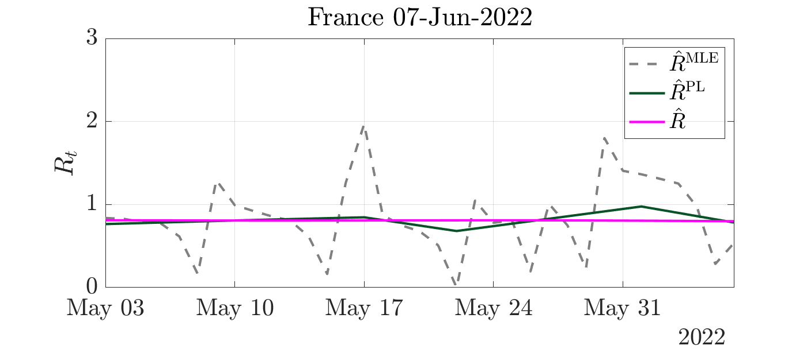
        
MAP estimates of the reproduction number

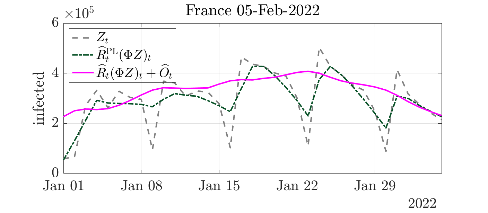
        
Denoised infection counts

  

### Credibility interval from  Monte Carlo

Complementary to the point-in-time above estimates, health authorities also need guidance on how much confidence to place in the reproductive number estimate.

In collaboration with [G. Fort](https://perso.math.univ-toulouse.fr/gfort/), [P. Abry](http://perso.ens-lyon.fr/patrice.abry/index.html) and [N. Pustelnik](http://perso.ens-lyon.fr/nelly.pustelnik/), we developed  Monte Carlo sampling yielding credibility interval estimate of the reproduction number.
To that aim, we design Markov chain Monte Carlo scheme, leveraging the Adjusted Langevin technology and adapting it to nonsmooth log-likehood.

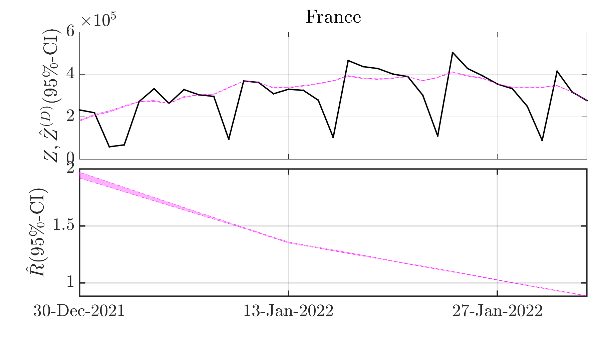

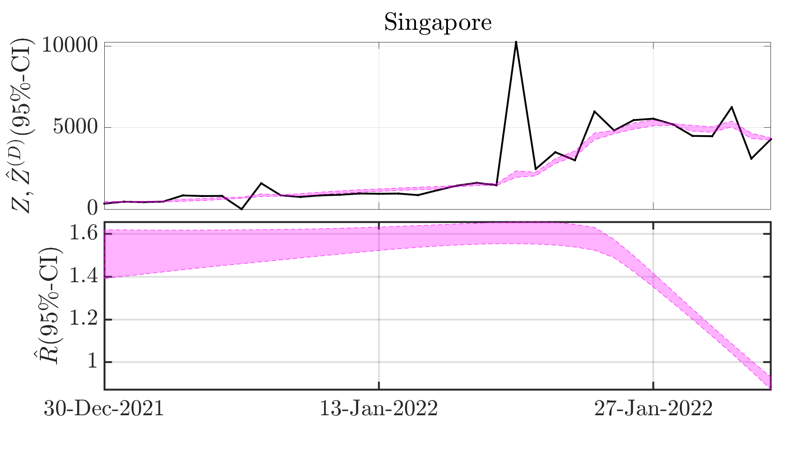

  

### Generalized time-frequency transforms and their zeros

Our journal [preprint](assets/pdfs/kravchuk_hal.pdf) introducing a novel covariant transform tailored for *discrete* signals and designing detection methodology based on the zeros of the associated spectrogram has been published in *IEEE Transactions on Signal Processing*. It is available on [hal](https://hal.archives-ouvertes.fr/hal-03553433/) and [arXiv](https://arxiv.org/pdf/2202.03835.pdf). The associated `Python` codes are available on [GitHub](https://github.com/bpascal-fr/kravchuk-transform-and-its-zeros).

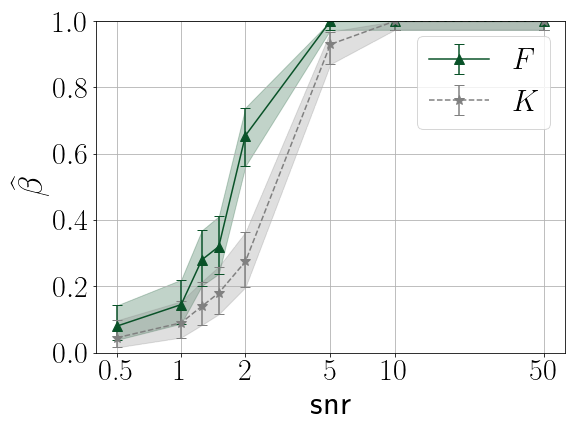
        
Power of the signal detection test depending on the functional statistics

My postdoctoral project focuses on the construction of *extended* **time-frequency transforms** and the study of their zeros, participating to the ERC project **Blackjack** holded by [Rémi Bardenet](https://rbardenet.github.io/).  

I am notably interested in the **statistics** of the random point process consisting of the zeros of the transform of white Gaussian noise, with the purpose to renew standard signal processing procedures classically based on spectrogram maxima by developing alternative zero-based methodologies. I am currently designing signal detection strategies leveraging the spatial statistics of the zeros of the new covariant transform we built.  

To give theoretical ground to this work, I investigates the links between covariant representations and **Gaussian Analytic Functions** making use of an **algebraic** formulation of generalized time-frequency transforms emphasizing the action an underlying symmetry group.
Further, I intend to benefits from a parallel with the quantum theory of **coherent states** in collaboration with Alexandre Feller.  

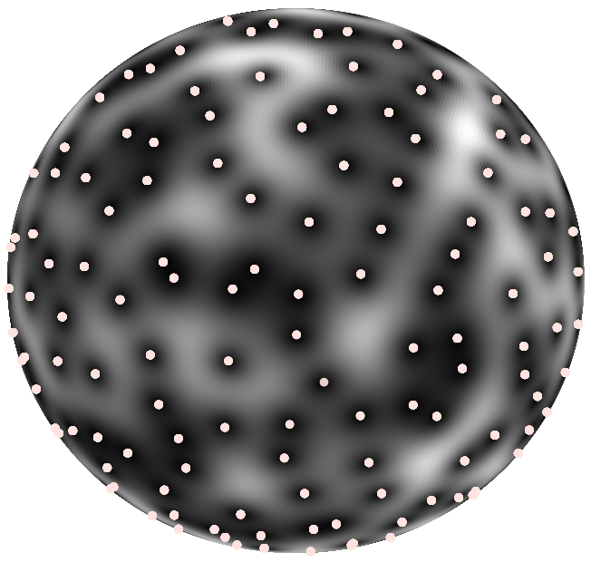
        
Zeros of the spherical Gaussian Analytic Function

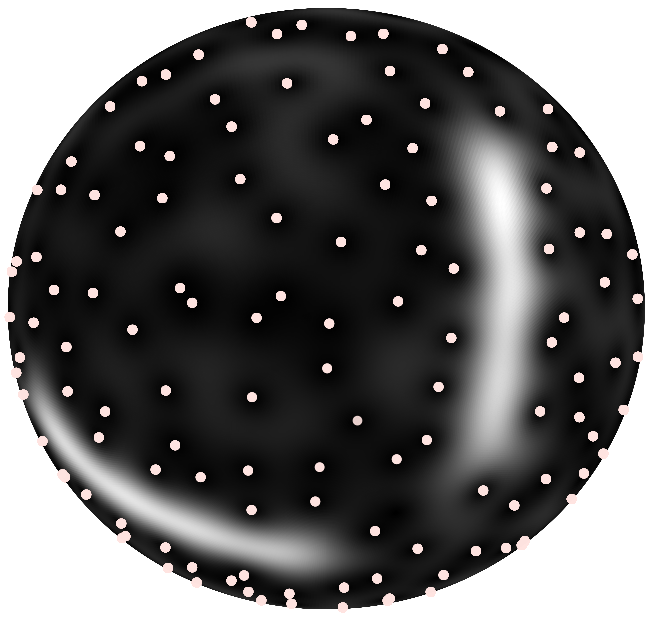
        
Spherical time-frequency transform in the presence of a signal

### Fractal texture segmentation relying on convex nonsmooth optimization

I did my PhD thesis under the supervision of [Patrice Abry](http://perso.ens-lyon.fr/patrice.abry) and [Nelly Pustelnik](http://perso.ens-lyon.fr/nelly.pustelnik) at [Laboratoire de Physique](http://www.ens-lyon.fr/PHYSIQUE) in [École Normale Supérieure de Lyon](http://www.ens-lyon.fr/), France.
I worked on **texture segmentation** based on fractal attributes, such as e.g. **local regularity**, designing convex functionals for **simultaneous** estimation and regularization of attributes maps.
Further, I developed an automated data-driven Stein Unbiased Risk Estimate based strategy for the fine-tuning of hyperparameters.

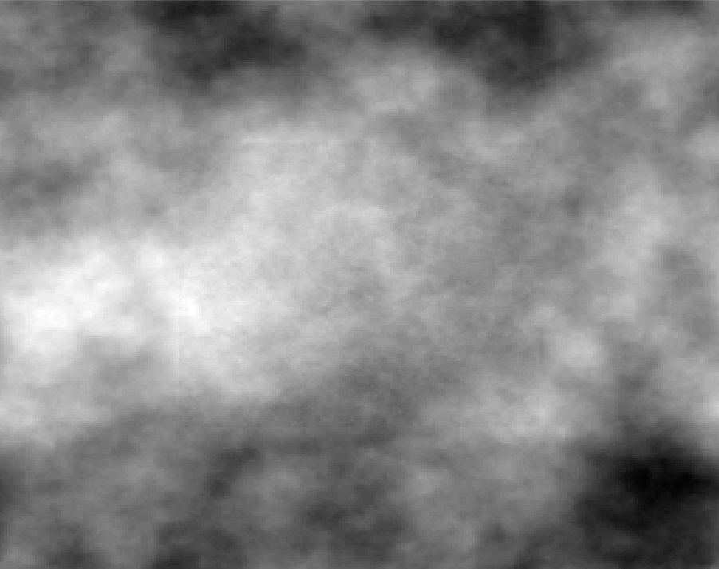
        
Piecewise monofractal texture

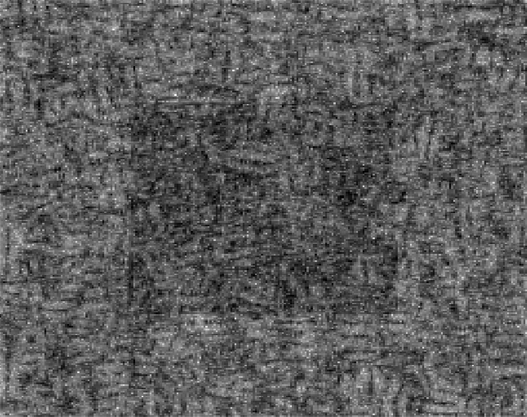
        
Local estimate of local regularity

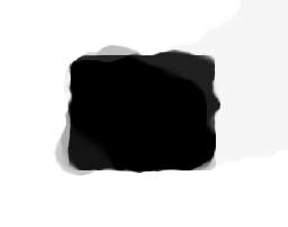
        
Denoised local regularity estimate

  

  

  <a href="https://www.ec-nantes.fr/"> 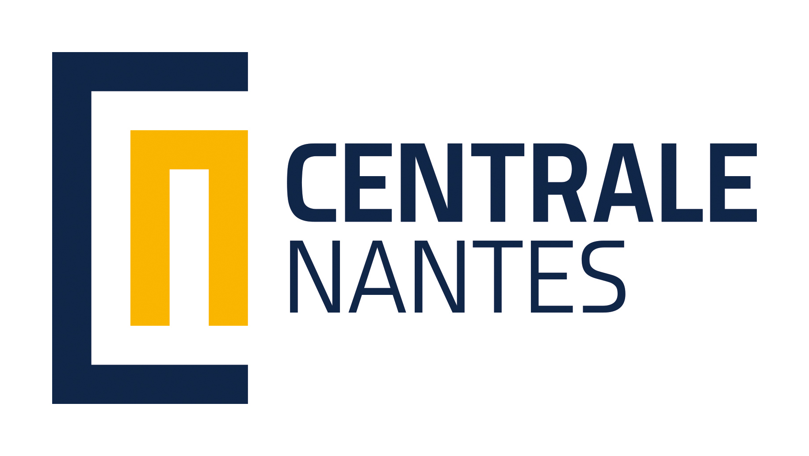</a>

  <a href="https://www.univ-nantes.fr/"> 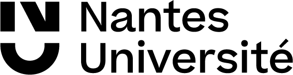</a>

