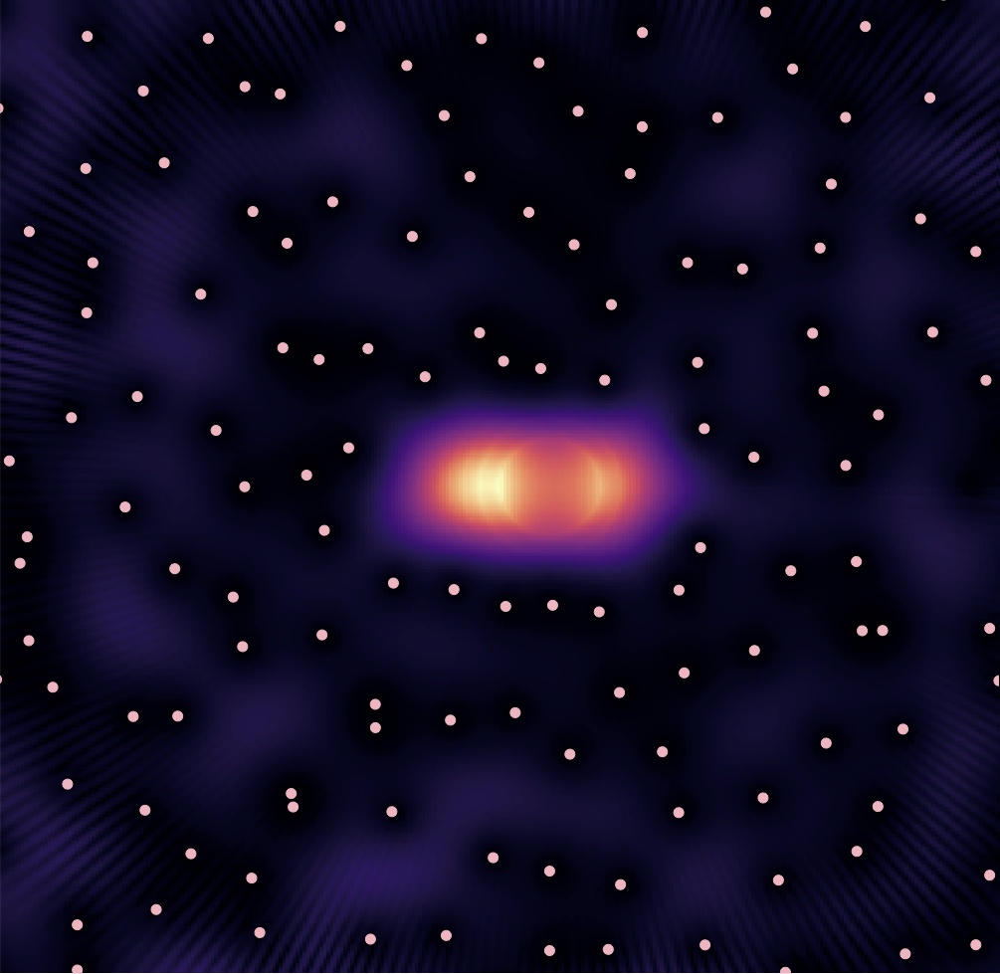

I am currently a postdoctoral researcher at [CRIStAL](https://www.cristal.univ-lille.fr/) in the [SigMA](https://www.cristal.univ-lille.fr/?rubrique27&eid=30) team in Lille, in the group of [Rémi Bardenet](https://rbardenet.github.io/), participating to  the ERC project **Blackjack**.

Here is a detailed curriculum vitae [in english](assets/pdfs/CV_en.pdf) and [in french](assets/pdfs/CV_fr.pdf).
## Research interests

My postdoctoral project focuses on the construction and study of *extended* **time-frequency transforms**.
I am interested in the **statistics** of the random point process consisting of the zeros of the transform of white Gaussian noise.
In particular, I investigates their potential link with the complex zeros of **Gaussian Analytic Functions**.  
For this purpose, I focus on an **algebraic** formulation of generalized time-frequency transforms emphasizing the action an underlying symmetry group.
Further, I intend to benefits from a parallel with the quantum theory of **coherent states**.
I am currently working on this project under supervision of [Rémi Bardenet](https://rbardenet.github.io/), and in collaboration with Alexandre Feller.

        
Spectrogram zeros

  

  

  

