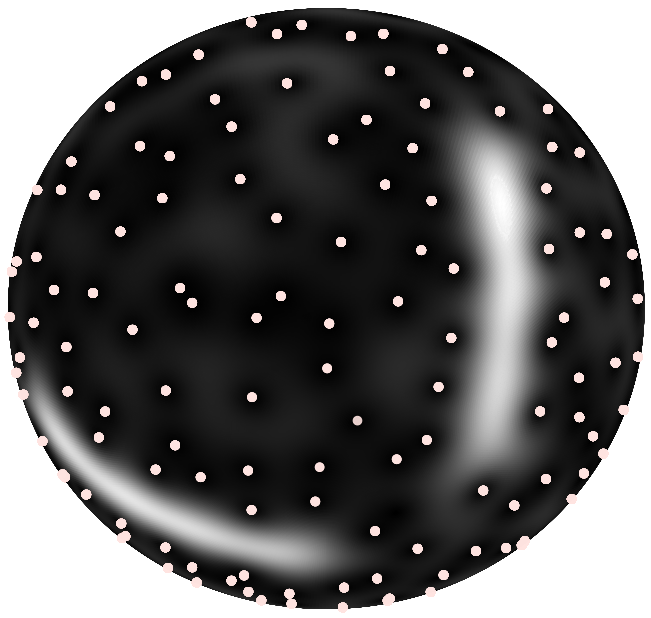

I am currently a postdoctoral researcher at [CRIStAL](https://www.cristal.univ-lille.fr/) in the [SigMA](https://www.cristal.univ-lille.fr/?rubrique27&eid=30) team in Lille, in the group of [Rémi Bardenet](https://rbardenet.github.io/), participating to  the ERC project **Blackjack**.

Here is a detailed curriculum vitae [in english](assets/pdfs/CV_en.pdf) and [in french](assets/pdfs/CV_fr.pdf).

## Research interests

### Generalized time-frequency transforms and their zeros

**!NEW!** Our journal [preprint](assets/pdfs/2022_TSP_hal.pdf) introducing a novel covariant transform tailored for *discrete* signals and designing detection methodology based on the zeros of the associated spectrogram has been submitted and is pending for verification [hal](https://hal.archives-ouvertes.fr/). The associated `Python` codes are available on [GitHub](https://github.com/bpascal-fr/kravchuk-transform-and-its-zeros).

My postdoctoral project focuses on the construction of *extended* **time-frequency transforms** and the study of their zeros, participating to the ERC project **Blackjack** holded by [Rémi Bardenet](https://rbardenet.github.io/).  

I am notably interested in the **statistics** of the random point process consisting of the zeros of the transform of white Gaussian noise, with the purpose to renew standard signal processing procedures classically based on spectrogram maxima by developing alternative zero-based methodologies. I am currently designing signal detection strategies leveraging the spatial statistics of the zeros of the new covariant transform we built.  

To give theoretical ground to this work, I investigates the links between covariant representations and **Gaussian Analytic Functions** making use of an **algebraic** formulation of generalized time-frequency transforms emphasizing the action an underlying symmetry group.
Further, I intend to benefits from a parallel with the quantum theory of **coherent states** in collaboration with Alexandre Feller.  

        
Zeros of the spherical Gaussian Analytic Function

        
Spherical time-frequency transform in the presence of a signal

### Fractal texture segmentation relying on convex nonsmooth optimization

I did my PhD thesis under the supervision of [Patrice Abry](http://perso.ens-lyon.fr/patrice.abry) and [Nelly Pustelnik](http://perso.ens-lyon.fr/nelly.pustelnik) at [Laboratoire de Physique](http://www.ens-lyon.fr/PHYSIQUE) in [École Normale Supérieure de Lyon](http://www.ens-lyon.fr/), France.
I worked on **texture segmentation** based on fractal attributes, such as e.g. **local regularity**, designing convex functionals for **simultaneous** estimation and regularization of attributes maps.
Further, I developed an automated data-driven Stein Unbiased Risk Estimate based strategy for the fine-tuning of hyperparameters.

        
Piecewise monofractal texture

        
Local estimate of local regularity

        
Denoised local regularity estimate

  

  

  

